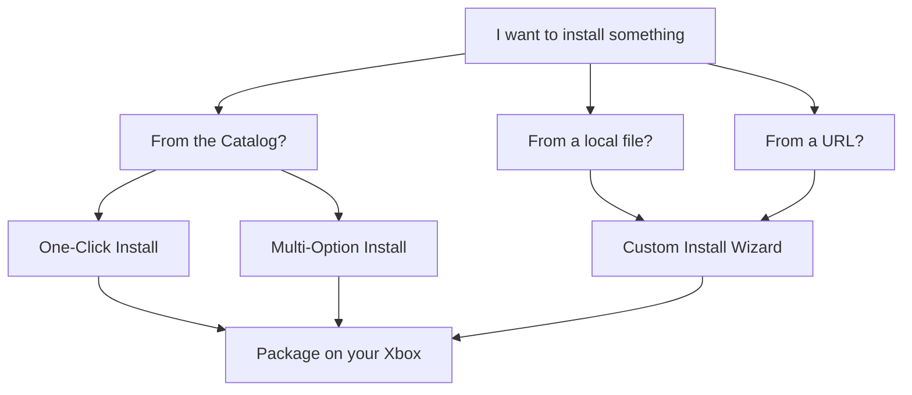
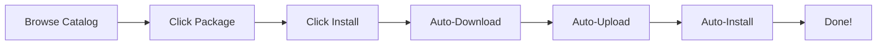
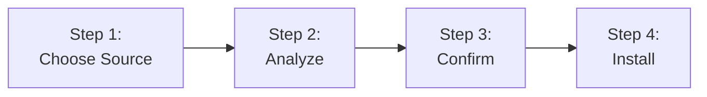
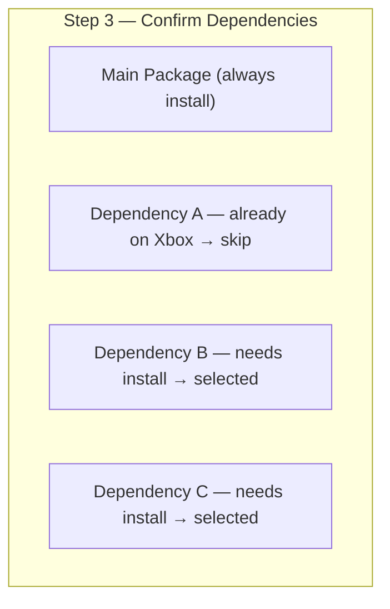

# Installing Packages

XB Homebrew Vault supports multiple ways to install homebrew packages on your Xbox. This page covers every installation method, from one-click catalog installs to custom local files.

---

## Installation Methods

---

## One-Click Install (from Catalog)

The simplest way to install:

1. Open the **Browse** tab
2. Find a package you want (use search or filters)
3. Click the card to open the detail view
4. Click **Install**
5. The app handles everything:
   - Downloads the package from the internet
   - Analyzes dependencies
   - Uploads to your Xbox
   - Installs automatically
6. Progress is shown in real-time

---

## Multi-Option Install

Some packages offer multiple download variants. For example, RetroArch might offer different core configurations.

When this is available:

1. Click **Install** on the detail view
2. A menu appears listing each variant
3. Select the one you prefer
4. Installation proceeds with your choice

---

## Custom Install Wizard

For installing `.appxbundle`, `.msixbundle`, `.appx`, `.msix`, or `.zip` files from your PC.

### Opening the Wizard

- Click the **Custom Install** button in the sidebar (folder icon)
- Or drag and drop a package file onto the app window

### The 4-Step Process

#### Step 1 — Choose Source

Select the package file to install:
- Click the browse button to pick a file from your PC
- Or drag and drop a file onto the window
- Supported formats: `.appxbundle`, `.msixbundle`, `.appx`, `.msix`, `.zip`

#### Step 2 — Analyze

The app examines the package:
- Reads the package manifest
- Identifies all required dependencies
- Shows a progress indicator while analyzing

#### Step 3 — Confirm

Review what will be installed:

- **Main package** — the app you're installing (always selected)
- **Dependencies** — frameworks, runtimes, and libraries the package needs
  - ✅ **Already installed on Xbox** — skipped automatically
  - 📦 **Needs install** — will be uploaded and installed
- You can **uncheck** dependencies you don't want to install (advanced)

#### Step 4 — Install

The wizard uploads and installs everything:
- Dependencies are installed **first** (dependency-first order)
- Each package shows progress
- You can **cancel** at any time using the Cancel button

### Understanding Dependencies

Xbox packages often need other packages to work. XB Homebrew Vault handles this automatically:

| Status | Meaning |
|--------|---------|
| **Already installed** | The dependency exists on your Xbox — skipped |
| **Needs install** | Will be uploaded and installed before the main package |
| **Skipped by you** | You unchecked it — the main package may not work without it |

**Dependencies are installed in order** — required frameworks are set up before the app that needs them.

---

## Drag & Drop Install

You can install packages by dragging files directly onto the app:

1. Open the **Custom Install Wizard** or **File Explorer** tab
2. Drag an `.appxbundle` or `.msixbundle` file from your file manager onto the window
3. A confirmation dialog appears
4. The wizard pre-fills with the dropped file
5. Click **Analyze** to begin

This works on Windows, macOS, and Linux.

---

## Installation Progress

During installation, you see:

- **Upload progress** — how much of the file has been transferred to your Xbox
- **Install progress** — the Xbox's package manager processing the file
- **Status messages** — what step is currently running
- **Cancel button** — stop the installation at any time

For large packages, the upload may take a few minutes depending on your network speed. A wired Ethernet connection is much faster than Wi-Fi for this.

---

## After Installation

Once a package is installed:

- It appears in the **Installed** tab
- You can **Launch** it immediately from the Installed view or from the detail view
- If the package has a newer version than what you had before, the catalog shows an **UPDATE** badge

---

## Common Install Issues

| Problem | What to Do |
|---------|-----------|
| **"Package manager busy"** | Wait 30-60 seconds — another install may be in progress |
| **"Dependency missing"** | Use Custom Install wizard — it resolves dependencies automatically |
| **Install stuck at 0%** | The package may be large — check the log for errors, or cancel and retry |
| **"Failed to upload"** | Check Xbox disk space; try wired connection for large files |
| **"Install completed but failure"** | Wait a moment, then check Installed view — sometimes it works on second try |

For more solutions, see the [Troubleshooting](Troubleshooting.md#install-problems) page.

---

## Canceling an Install

You can cancel any in-progress installation:

1. Click the **Cancel** button during the install
2. The upload stops and any partially transferred files are cleaned up
3. The package manager state resets

> **Note:** If you cancel after the Xbox has started processing (install phase, not upload phase), the package may be partially installed. Check the Installed view and uninstall if needed.
