# Settings

The **Settings** tab lets you configure your Xbox connection, app preferences, and maintenance options. Changes only take effect when you click **Save**.

---

## Layout

```mermaid
flowchart TB
    subgraph SettingsPage["Settings Tab"]
        Toolbar["Toolbar: Save / Discard / Reset"]
        subgraph Connection["Connection Configuration"]
            Addr["Address, Port, Username, Password"]
            Https["Use HTTPS"]
            TestBtn["Test Connection"]
        end
        subgraph Preferences["Application Settings"]
            LogLevel["Log Level"]
            UIScale["UI Scale"]
            CheckInterval["Connection Check Interval"]
            ResetSize["Reset Window Size"]
        end
        subgraph Maintenance["Maintenance"]
            LogsFolder["Open Logs Folder"]
            LogsScreen["Open Logs Screen"]
            ClearCache["Clear Cache"]
            Restart["Restart App"]
            SettingsFolder["Open Settings Folder"]
            ResetAll["Reset All Settings"]
        end
    end
    Toolbar --> Connection --> Preferences --> Maintenance
```

---

## Toolbar

At the top of the Settings tab, three buttons control your edits:

| Button | What It Does |
|--------|-------------|
| **Save** | Persists all changes on the screen |
| **Discard Changes** | Reverts the form to the last saved state |
| **Reset to Default** | Resets the form to factory defaults (saved only after you click Save) |

A small **Unsaved changes** badge appears whenever the form differs from what's saved — a reminder to save or discard.

---

## Connection Configuration

These fields control how XB Homebrew Vault connects to your Xbox.

| Field | Description | Default |
|-------|-------------|---------|
| **Address** | IP address or hostname of your Xbox | — |
| **Port** | Dev Mode API port | `11443` |
| **Username** | Dev Mode credentials | `DevToolsUser` |
| **Password** | Dev Mode password (stored obfuscated, not plaintext) | — |
| **Use HTTPS** | Connect over HTTPS when supported | ✅ Enabled |

### Test Connection

Click **Test Connection** to verify your settings work without saving. This is useful when:
- You've changed your Xbox's IP address
- You've updated your Dev Mode credentials
- You're troubleshooting a connection issue

---

## Application Settings

| Setting | Description | Default |
|---------|-------------|---------|
| **Log Level** | Controls what gets logged: `Debug`, `Info`, `Warn`, `Error` | `Info` |
| **UI Scale** | Zoom level for the interface (80–120%) | 100% |
| **Connection Check Interval** | How often the app re-checks your Xbox connection | 30 minutes |
| **Reset Window Size** | Returns the main window to its default dimensions | — |

### Log Level Explained

| Level | What It Records |
|-------|----------------|
| **Debug** | Everything — very verbose, useful for troubleshooting |
| **Info** | Normal operations — recommended for everyday use |
| **Warn** | Only warnings and errors |
| **Error** | Only errors |

> **Tip:** Use `Debug` level when troubleshooting, then switch back to `Info` for normal use. Debug logging can slow things down slightly.

### UI Scale

If the interface looks too small or too large on your display:
- Drag the slider between 80% and 120%
- Changes apply **immediately** (no need to save first)
- Useful for HiDPI displays or small screens

---

## Maintenance

### Open Logs Folder

Opens the folder where log files are stored:
- **Windows:** `%APPDATA%/XBVault/logs/`
- **Linux/macOS:** `~/.local/share/XBVault/logs/`

Useful when you need to attach logs to a bug report.

### Open Logs Screen

Jumps directly to the **Logs** view — a live log console showing recent app activity with multi-select, copy, and auto-scroll.

### Clear Cache

Empties the package catalog cache. The catalog is re-fetched from the internet on next load. Use this if:
- The catalog seems outdated or corrupted
- You're troubleshooting display issues
- You want a fresh start

### Restart Application

Closes and relaunches XB Homebrew Vault. Useful after changing settings that require a full restart.

### Open Settings Folder

Opens the folder containing `settings.json` — the file where your connection and preferences are stored.

### Reset All Settings

**Wipes all saved settings** and restores factory defaults immediately. This includes:
- Connection details (address, port, credentials)
- Log level and UI preferences
- All other configuration

> **Warning:** This cannot be undone. You'll need to re-enter your Xbox connection details after resetting.

---

## Where Settings Are Stored

| Platform | Location |
|----------|----------|
| **Windows** | `%APPDATA%/XBVault/settings.json` |
| **Linux** | `~/.local/share/XBVault/settings.json` |
| **macOS** | `~/Library/Application Support/XBVault/settings.json` |

The settings file contains your connection details and preferences. Credentials are **obfuscated** (not stored in plain text).

---

## Keyboard Shortcuts

| Shortcut | Action |
|----------|--------|
| **Ctrl+S** | Save settings |
| **Ctrl+Tab** | Cycle through tabs (reaches Logs view) |
| **Escape** | Close settings / go back |

---

## Tips

- **Test before saving** — use Test Connection to verify before committing new settings
- **UI Scale is instant** — no need to save; changes apply as you drag the slider
- **Log level is remembered** — the app re-reads it on every startup
- **Don't edit settings.json manually** unless you know what you're doing — use the Settings UI instead
