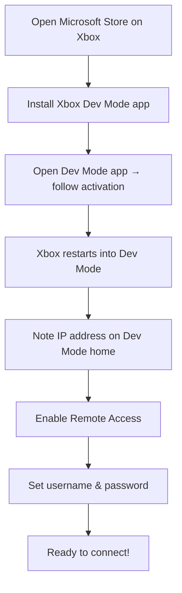
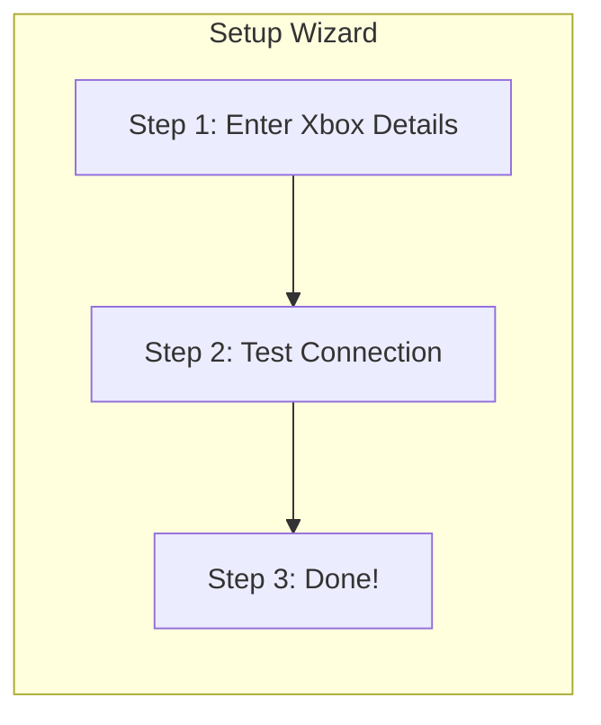
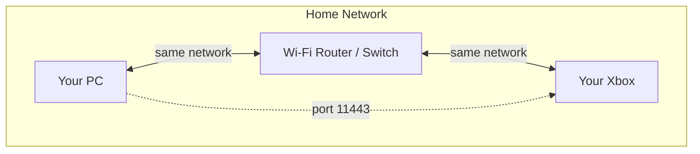

# Setup & Connection

This guide walks you through downloading, installing, and connecting XB Homebrew Vault to your Xbox for the first time.

---

## Prerequisites

Before you start, make sure you have:

1. **An Xbox One or Xbox Series S|X** — it must support Developer Mode
2. **Developer Mode enabled** on your Xbox (see below)
3. **A PC** running Windows 10/11, macOS, or Linux
4. **Both devices on the same Wi-Fi or Ethernet network**

---

## Step 1: Enable Developer Mode on Your Xbox

If you haven't already, you need to enable Developer Mode on your Xbox:

1. On your Xbox, open the **Microsoft Store**
2. Search for and install the **Xbox Dev Mode** app
3. Open the Dev Mode app — it will guide you through activation
4. When done, your Xbox will restart into **Dev Mode**

Once in Dev Mode:

1. On the Dev Mode home screen, note the **IP address** shown
2. Go to **Remote Access** and make sure it is **enabled**
3. Set a **username** (default is `DevToolsUser`) and a **password** — remember these, you'll need them in the app

---

## Step 2: Download XB Homebrew Vault

1. Go to the [latest release page](https://github.com/marcelofrau/xb-homebrew-vault/releases/latest)
2. Download the ZIP for your platform:

| Your System | Download This |
|-------------|--------------|
| Windows 10/11 (most PCs) | `XBVault-v*-win-x64.zip` |
| Windows on ARM (Surface Pro X) | `XBVault-v*-win-arm64.zip` |
| macOS (Apple Silicon — M1/M2/M3/M4) | `XBVault-v*-osx-arm64.zip` |
| macOS (Intel) | `XBVault-v*-osx-x64.zip` |
| Linux (most PCs) | `XBVault-v*-linux-x64.zip` |
| Linux ARM (Raspberry Pi) | `XBVault-v*-linux-arm64.zip` |

3. Extract the ZIP to any folder on your PC (e.g., `C:\XBVault` or `~/XBVault`)
4. No installation needed — the app is fully self-contained

---

## Step 3: Launch and Connect

### First-Time Launch

When you open XB Homebrew Vault for the first time, a **Setup Wizard** appears automatically:

**Step 1 — Enter your Xbox details:**
- **Address:** The IP address shown on your Xbox's Dev Mode home screen (e.g., `192.168.1.100`)
- **Port:** `11443` (this is the default — don't change it unless you know you need to)
- **Username:** `DevToolsUser` (or whatever you set in Dev Mode)
- **Password:** The password you set in Dev Mode

**Step 2 — Test Connection:**
- Click the **Test Connection** button
- If it succeeds, you'll see a green checkmark
- If it fails, check the [Troubleshooting](Troubleshooting.md) page

**Step 3 — Done:**
- Click **Finish** — you're ready to go!

### Connecting Later

If the app was already set up and you need to reconnect:

1. Look at the **sidebar** — the connection status shows "Disconnected"
2. Click the **Connect** button in the sidebar (or go to Settings)
3. Enter your credentials if prompted
4. The app connects automatically

> **Important:** The app will **never** auto-connect on its own. You always click Connect to start a session.

---

## Connection Status Indicators

The sidebar shows your connection state:

| Status | Meaning |
|--------|---------|
| **Not configured** | No Xbox details entered yet — run the setup wizard |
| **Disconnected** | Xbox details are saved but not connected — click Connect |
| **Connecting...** | Attempting to connect — wait a moment |
| **Connected** | Successfully connected to your Xbox |

---

## Network Requirements

For the connection to work:

- Your PC and Xbox **must** be on the same local network (same Wi-Fi router or same Ethernet switch)
- Port **11443** must not be blocked by your firewall
- A wired (Ethernet) connection is recommended for faster file transfers, but Wi-Fi works fine for browsing and installing

---

## Changing Connection Settings

After initial setup, you can change your connection details anytime:

1. Go to **Settings** (sidebar tab)
2. Edit the address, port, username, or password
3. Click **Save** to persist the changes
4. Click **Test Connection** to verify the new settings work

See the [Settings](Settings.md) page for full details.

---

## Next Steps

Once connected, you can:

- [Browse the Catalog](Catalog-Browser.md) — discover homebrew apps and emulators
- [Install Packages](Installing-Packages.md) — one-click install from the catalog
- [Explore Dev Tools](Dev-Tools.md) — screenshot, system info, performance monitor
- [Browse Files](File-Explorer.md) — manage files on your Xbox via SSH/SFTP

---

## Troubleshooting

If you can't connect, see the [Troubleshooting — Connection Problems](Troubleshooting.md#cant-connect-to-xbox) section for solutions to common issues.
